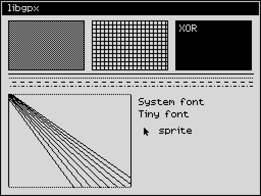
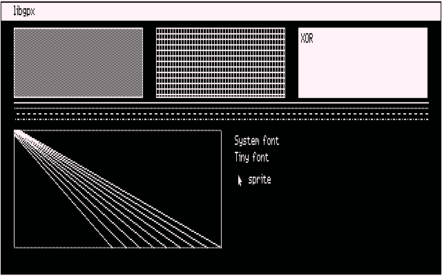
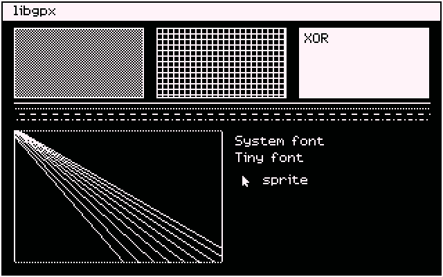
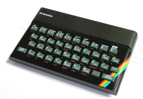
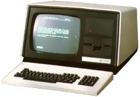
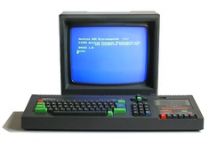

# libgpx

A 1-bit-per-pixel graphics library for Z80 machines, written entirely in
hand-optimised assembly.

libgpx gives you pixels, lines, rectangles, pattern fills, text and
sprites behind one API that behaves the same on every supported machine,
so a program written against it draws the same picture wherever it runs.

**The full programming manual is
[docs/manuals/PROGRAMMING-LIBGPX.md](docs/manuals/PROGRAMMING-LIBGPX.md)** —
every function, its parameters, worked examples, complete programs and
screenshots from both machines.

| Machine | Screen | Backend |
|---|---|---|
| ZX Spectrum 48K | 256 x 192 | `src/zx` |
| Iskra Delta Partner | 1024 x 256 or 1024 x 512 | `src/partner` |
| Amstrad CPC | 640 x 200 or 320 x 200 | `src/cpc` |

The machines have almost nothing in common. The Spectrum has a packed
framebuffer the CPU reads and writes directly; the Partner has an EF9367
drawing coprocessor and display memory the CPU cannot read at all; the CPC
interleaves its framebuffer into eight banks and changes how many pixels
fit in a byte depending on the display mode. libgpx hides the difference.

The same program, unchanged, on three machines and four screen geometries:

| | |
|---|---|
| ZX Spectrum, 256 x 192 |  |
| Amstrad CPC, 640 x 200 |  |
| Amstrad CPC, 320 x 200 |  |

## Building

Everything builds inside pinned Docker images carrying the X Tools Z80
toolchain (`xcc`, `xas`, `xld`, `xar`, `xprog`) and an emulator, so
Docker and Python 3 are the only requirements — no host toolchain.

| Machine | Image |
|---|---|
| ZX Spectrum | `wischner/xcc-z80-zx-spectrum` |
| Iskra Delta Partner | `wischner/xcc-z80-idp` |
| Amstrad CPC | `wischner/xcc-z80` |

```bash
make lib           # bin/libgpx.lib          (ZX Spectrum)
make partner-lib   # bin/partner/libgpx.lib  (Partner)
make cpc-lib       # bin/cpc/libgpx.lib      (CPC, both display modes)
make build         # all of them, plus the test binaries
make clean
```

One CPC library serves both display modes. Pass `GPXM_CPC_640X200` (the
default) or `GPXM_CPC_320X200` to `gpx_create()`; it programs the CRTC and
the Gate Array to match and records the geometry, and `gpx_width()` reports
it from then on. The modes pack a different number of pixels into a byte, so
the mode test is deliberately coarse — it sits once per run, once per row or
once per byte, never once per pixel.

## Using it

Include the one public header, call `gpx_create()` once, draw, and link
against your machine's library.

```c
#include "libgpx.h"

void main(void)
{
    gpx_t *gpx = gpx_create(GPXM_DEFAULT);
    rect_t r = {10, 10, 100, 60};

    gpx_clrscr();
    gpx_draw_rectangle(gpx, &r, CO_FORE, BM_CPY, 0xFF, 0);
    gpx_draw_text(gpx, 14, 14, "hello", gpx_get_system_font(),
                  CO_FORE, BM_CPY, 0);
    gpx_destroy(gpx);
}
```

Text is opaque by default, including the advance between adjacent characters.
Call `gpx_set_text_background(gpx, GPX_TEXT_BG_TRANSPARENT)` before drawing an
overlay that should preserve both the glyph background and character spacing.

Compile and link for the ZX Spectrum:

```bash
docker run --rm -u $(id -u):$(id -g) -v "$PWD":/work -w /work \
    wischner/xcc-z80-zx-spectrum sh -lc '
        xcc -mz80 -std=c11 -Os -Iinclude -c -o build/hello.rel hello.c
        xcc -mz80 -nostartfiles -o build/hello.bin \
            build/crt0.rel build/hello.rel bin/libgpx.lib \
            -Wl,--oformat=binary -Wl,-b,_CODE=0x8000'
```

For the Partner, swap the image for `wischner/xcc-z80-idp`, the library
for `bin/partner/libgpx.lib`, and the load address for `0x100` (CP/M
`.com`). The C source does not change.

For the Amstrad CPC, use `wischner/xcc-z80`, `bin/cpc/libgpx.lib` and
`bin/cpc/crt0-cpc.rel`. The result is a raw binary that runs at `0x8000`
with no firmware underneath it: `gpx_create()` programs the CRTC and the
Gate Array itself and pages both ROMs out, the same way the Partner backend
programs its own PIO.

```bash
docker run --rm -u $(id -u):$(id -g) -v "$PWD":/work -w /work \
    wischner/xcc-z80 sh -lc '
        xcc -mz80 -std=c11 -Os -Iinclude -c -o build/hello.rel hello.c
        xld --oformat=binary -b _CODE=0x8000 -nostartfiles \
            -o build/hello.bin bin/cpc/crt0-cpc.rel \
            build/hello.rel bin/cpc/libgpx.lib'
```

## Demos

Every demo builds for both machines. Its page explains the source, build and
run workflow, and places MCP-emulator screenshots side by side so backend and
screen-geometry differences are visible.

| Demo | What it demonstrates |
|---|---|
| [Demo 1 — dimensions and cursors](samples/demo1/README.md) | fixed 256x192 fill, reported screen size, stock cursors, sprite show/hide |
| [Demo 2 — full-API smoke test](samples/demo2/README.md) | fixed 1024x256 diagnostic scene and physical-screen clipping |
| [Demo 3 — portable examples](samples/demo3/README.md) | resolution-adaptive panels and sprite restoration programs |

Build any demo for both targets, or select one backend:

```bash
make -C samples/demo1 build
make -C samples/demo2 zx
make -C samples/demo3 partner
```

The output is a Spectrum `.tap` and a Partner CP/M `.com`. The manual's
[demo reference](docs/manuals/PROGRAMMING-LIBGPX.md#demo-directory-reference)
connects these programs to the API concepts they exercise.

## The three backends, side by side

| |  |  |  |
|---|:---:|:---:|:---:|
| | **ZX Spectrum** | **Iskra Delta Partner** | **Amstrad CPC** |
| Display | 256 x 192 | 1024 x 256 | 640 x 200 / 320 x 200 |
| Z80 clock | 3.5 MHz | 4 MHz | 4 MHz |
| Drawing | software | EF9367 coprocessor | software |
| Library size | 7,600 B | 7,126 B | 8,381 B |

The CPC is the largest because one library serves both display modes, and
mode 1 packs four pixels to a byte where mode 2 packs eight -- so the span,
blit and line paths each carry a second form. The Partner is the smallest
because the chip does the rasterising.

### Speed

`make crossbench` draws the *same picture* on every machine -- fixed
coordinates inside a 256x192 box that fits every display -- and times it, so
the numbers can be compared directly. The per-backend suites
(`make zx-bench`, `make cpc-bench`) size their work from `gpx_width()` and
so cannot be.

Milliseconds, because the Spectrum's Z80 runs at 3.5 MHz and the other two at
4 MHz. Lower is better; the best in each row is in bold.

| Benchmark | ZX Spectrum | Partner | CPC 640x200 | CPC 320x200 |
|---|--:|--:|--:|--:|
| 64 solid rays, all octants | 756 | **36** | 683 | 714 |
| the same rays, dashed | 720 | 1,716 | **648** | 680 |
| 8 solid fills, 248x184 | 821 | 634 | **587** | 734 |
| 8 patterned/XOR fills | 903 | 10,234 | **760** | 1,139 |
| 200 sprite show+hide pairs | **2,035** | 5,401 | 3,058 | 3,785 |
| 60 lines of text, 3 modes | 5,989 | 11,803 | **5,724** | 7,083 |
| 16 full-screen clears | 455 | see below | 558 | 558 |

What the table is really showing:

* **The Partner wins wherever the EF9367 can do the work itself** -- a solid
  vector is 21x faster than the fastest software Bresenham here -- and loses
  badly wherever it cannot. A pattern cannot be handed to the chip's area
  fill, so patterned fills fall back to software and cost 11x what the
  Spectrum pays. It is a vector machine, and it rewards being used as one.
* **The CPC leads on raster work** despite pushing 2.6x the Spectrum's pixels
  in mode 2, partly from the faster clock and partly because its span, fill
  and line paths are the most heavily tuned. Its weak spot is sprites, where
  saving and restoring the background costs more than on the Spectrum.
* **CPC mode 1 is consistently slower than mode 2** for the same picture:
  four pixels to a byte means a read-modify-write where mode 2 can store, and
  the blitter has to gather two screen bytes into one eight-pixel value.
* **Clears are not comparable**: `gpx_clrscr()` clears the whole display, and
  the displays are different sizes. On the Partner it is issued to the
  coprocessor and returns almost immediately, so no honest figure belongs in
  that column -- the CPU spends 3,131 T-states while the chip works on for
  roughly 130,000 more.

Measured with `make crossbench`; the emulators are cycle-accurate, so the
numbers are reproducible rather than sampled.

## Testing

```bash
make tests           # everything below
make zx-tests        # ZX differential suite vs an independent C oracle
make partner-gdp-tests   # Partner suite on the emulated EF9367
make cpc-tests       # CPC suite, both display modes, on amstrad-cpc-mcp
make cpc-bench       # CPC micro-benchmarks, in T-states, both modes
make conformance     # one program on all three backends, compared pixel for pixel
make crossbench      # the same picture timed on all three, for comparison
```

`make conformance` is the gate that keeps the backends from drifting
apart: it compiles a scenario once per backend, runs it on every
emulator and diffs the rasters against the ZX. The CPC is checked in
both display modes and has to match *exactly* -- it shares the ZX's
font, cursors and software rasteriser, so it has no licence to differ. See [tests/README.md](tests/README.md) for how the
suites work and how to add a scenario.

## Repository layout

| Path | Contents |
|---|---|
| `include/libgpx.h` | the public API and data formats |
| `src/zx/`, `src/partner/`, `src/cpc/` | the three backends, hand-written Z80 assembly |
| `samples/` | dual-platform demos with illustrated README pages |
| `tests/` | test suites, benchmarks, size and coverage tooling |
| `docs/manuals/` | the programming manual |
| `docs/images/screenshots/` | emulator captures, regenerated by `scripts/docs/` |
| `docs/images/diagrams/` | hand-drawn figures |
| `docs/images/platforms/` | photographs of the machines |
| `docs/standards/` | coding standards this project follows |
| `docs/todo/` | working notes, not part of the library |
| `scripts/mk/` | shared toolchain and Docker image definitions |
| `scripts/run/`, `scripts/check/`, `scripts/docs/` | launchers, style checks, doc generation |
| `bin/`, `build/` | generated artifacts |
| `archive/` | older snapshots, not used by the current build |

## Licence

GPL2 — see [LICENSE](LICENSE).
