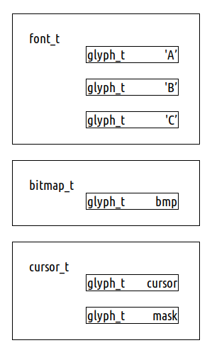

# libgpx

Welcome to **libgpx**, a multiplatform graphics library for 8bit micros. 

# Compiling libgpx

Run the `make` command with platform name as target in the root directory.

 > Supported platforms are `zxspec48` and `partner` and are 
 > case sensitive!

~~~
make PLATFORM=partner
~~~

After the compilation object and debug files are available in the `build` directory, and the `libgpx.lib` is copied to the `bin` directory. 

# Using libgpx

## Tiny coding convention

(...to be continued...)

## Dependencies

*libgpx* has been designed as an independent library. It incudes 
`stdbool.h`, and `stdint.h`, but uses its' own implementations.

## Initializing

To initialize the library, call `gpx_init()` function. This function returns a pointer to the `gpx_t` structure, which you pass to all other functions of the *libgpx*.

After you're done with using the library, you should call the `gpx_exit()`. On some platform this call just deletes the `gpx_t` structure. On others it switches from grapics back to text mode.

~~~cpp
#include <gpx.h>

void main() {
    gpt_t* g=gpx_init();
    /* your drawing code here */
    gpx_exit(g);
}
~~~

## Querying platform graphics capabilities

If you would like to know what the gpx library can do on your platform, you can call `gpx_cap().` This function will query platform graphics capabilities (resolution, no. of pages, black and white color, etc.). This function will return pointer to `gpx_cap_t`.

~~~cpp
#include <gpx.h>
#include <stdio.h>

void main() {
    /* enter gpx mode */
    gpx_t *g=gpx_init();

    /* query graphics capabilities */
    gpx_cap_t *cap=gpx_cap(g);
    printf("GRAPHICS PROPERTIES\n\n");
    printf("No. colors %d\nBack color %d\nFore color %d\n",
        cap->num_colors,
        cap->back_color,
        cap->fore_color);
    printf("Sup. pages %d\n", cap->num_pages);
    /* enum. pages */
    for(int p=0; p<cap->num_pages; p++)
        /* enum resolutions (for page) */
        for (int r=0; r<cap->pages[p].num_resolutions; r++)
            printf(" P%d Resol. %dx%d\n",
                p,
                cap->pages[p].resolutions[r].width,
                cap->pages[p].resolutions[r].height);
    
    /* leave gpx mode */
    gpx_exit(NULL);
}
~~~

And the result on ZX Spectrum 48K.

## Page switching

If the platform supports multiple pages you can call `gpx_get_page()` and `gpx_set_page()` to switch pages. Both calls also contain `flags` member which tell whether you'd just like to redirect graphical writes to page (but not switch) or switch to a page.

Once you set the page, all operations will go to that page.

## Colors

The library at present only supports monochrome graphics, but its interface is prepared for color displays. You can set the color by calling `gpx_set_color()`, passing the `color_t` and color flags. Flags are used because on some systems you can set background and foreground color (for example: paper and ink on ZX Spectrum).

You can obtain black and white colors and number of supported colors by calling the `gpx_query_cap()`.

## Clipping

You can set a rectangular clipping region for all drawing. The clipping region is of type `rect_t` and is set by calling `gpx_set_clip()`. Passing `NULL` sets entire screen as the clipping region (=no clipping).

## Blit mode

Operations such as drawing lines, use blit mode. At present two blit modes are supported: `BM_XOR` and `BP_COPY`. You can set the blit mode using function `gpx_set_blit()` and read it by `gpx_get_blit()`.

## Patterns

### Line pattern

Call `set_line_pattern()` to pass a 1 byte line pattern. You can use predefined line patterns or custom line patterns. If you use a predefined pattern it might get hardware accelerated. 

The predefined patterns are:
 * LP_SOLID    11111111
 * LP_DOTTED   10101010
 * LP_DASHED   11001100

### Fill pattern

Call the `set_fill_pattern()` to pass a min. 1 to max 8 byte fill pattern.

## Resolution

You can obtain resolution indexes by calling `gpx_get_cap()` and iterating through the `gpx_page_t[] pages` member. Each page has a `gpx_resolution_t[] resolutions` member, which contains resolutions.

By convention the resolutions are ordered from lowest to highest.

 > On some platforem `libgpx` emulates lower resolutions (for example - 
 > gpx emulates 512x256 on Iskra Delta Partner). 

Resolution is also set per page, so make sure you set it for all pages you are using.

~~~cpp
#include <gpx.h>

void main() {
    /* enter gpx mode */
    gpx_t *g=gpx_init();
    /* set screen resolution */
    gpx_set_resolution(g,0);
    /* exit gpx mode */
    gpx_exit(g);
}
~~~

## Clearing the screen

Use `gpx_cls()` to clear screen. Clear screen will respect 
current back color, fore color and page setting.

~~~cpp
#include <gpx.h>

void main() {
    /* enter gpx mode */
    gpx_t *g=gpx_init();
    /* clear screen */
    gpx_cls();
    /* exit gpx mode */
    gpx_exit(g);
}
~~~

## Drawing!

All drawing functions start with `gpx_draw_` and all fill functions start with `gpx_fill_`. They only accept coordinate arguments, because all other aspects of drawing (color, blit mode, clipping) is set by a separate function and stored in the `gpx_t` structure.

Following functions are available.
 * `gpx_draw_line()` ... draws a line
 * `gpx_draw_circle()` ... draws a circle 
 * `gpx_draw_rect()` ... draws a rectangle
 * `gpx_fill_rect()` ... draws a filled rectangle

 > All functions are optimized. For example - when drawing a line,
 > horizontal line is detected and drawn using super- speeed function.

~~~cpp
#include <gpx.h>

void main() {

    /* enter graphics */
    gpx_t *g=gpx_init();

    /* clear screen */
    gpx_cls(g);

    /* query graphics capabilities
       NOTE: this is only possible because initial page
             and initial resolution are both 0. */
    gpx_cap_t *cap=gpx_cap(g);
    coord centerx = cap->pages[0].resolutions[0].width/2;
    coord centery = cap->pages[0].resolutions[0].height/2;

    printf("Center is at %d,%d\n",centerx, centery);

    /* draw line */
    for (coord x=centerx-20; x<centerx+20;x++)
        gpx_draw_pixel(g,x,centery);

    /* draw circle */
    gpx_draw_circle(g,centerx,centery,20);

    /* leave graphics */
    gpx_exit(NULL);
}
~~~

And the result on ZX Spectrum 48K.

## Glyphs

The glyph is a basic building block of bitmapped graphics. Several classes 
of glyph are supported, each having a minimal header, just enough to draw 
the glyph. Each glyph type has its own optimal drawing function. 

### Glyph classes

Each glyph has a 4 byte glyph header. First three bits tell the glyph class.
At present only 2 bits are used for the class, and bit 0 is reserved for
possible future extensions.

Following glyph classes are supported.

| Name      | Class | Description                                |
|-----------|-------|--------------------------------------------|
| Raster    |  X00  | Encoded as standard 1bpp raster            |
| Tiny      |  X01  | Encoded as Partners' relative movements    |
| Lines     |  X10  | Encoded as lines (scanlines or outline)    |
| RLE       |  X11  | Encoded as RLE compressed graphics         |

The rest of the 4 byte structure depends on glyph class.

#### Glyph format limits

The `*glyph_t` structure immposes some reasonable limits for a glyph. 
All glyhps except the *RLE* are limited to 256x256. *RLE* has
two extra bits for width and height, limiting its size to
1024x1024. *RLE* also does not need size information, because the number
of rows equals to height, and each individual row has information about 
its size. *Tiny* glyph can have max. 256 moves, and *line* glyph can 
have max. of 4096 lines.

 > For obvious reasons, glyph type *Tiny*, which contains direct 
 > commands for *Iskra Delta Partner GDP* is not supported on other
 > platforms.

### Array of glyphs: the envelope approach

Glyphs can be combined into more complex bitmapped structures, such as 
fonts, animations, bitmaps, icons, or mouse mouse cursors. All of these 
structures are arrays (or envelopes) containing basic glyphs. By using 
the envelope approach one can create an animation or a font, made out 
of any glyph types.

 > The tradeoff of this approach is that each glyph array (such as
 > a font) is a bit larger, because collective properties, such as
 > font height are stored with each glyph. But it also results in 
 > smaller and faster code, required to manage graphics.

### Glyph drawing functions

Here are four main glyph drawing functions.

 * `gpx_draw_glyph()` ... draws a glyph
 * `gpx_draw_mglyph()` ... draws a masked glyph
 * `gpx_read_glyph()` ... read a bitmap from screen

## Fonts

Fonts are implemented using the glyph group of drawing functions, because each letter is just a glyph, with some extra drawing hints. 

To use font you need to load it (unless already part of your C code). Each font starts with the `font_t` structure where you can find some basic font information such as average width, height, number of characters, etc.

You then simply call `gpx_draw_string()` to draw a sting. 

 > Don't forget that fonts also use the *blit mode*, and if it is not `BM_COPY`, background may not be deleted.

### Font header

The font header structure contains basic information about the font and a table of pointers to each
glyph. This way glyphs can have different sizes (i.e. in proportional fonts, the letter i takes much
less memory space than the letter w) and we avoid expensive calculations to find each glyph.

Because each glyph contains its width, it also makes it easy for us to measure strings by simply
iterating through all the glyphs in the string, and maxing the height and summing the width.

### Measuring text

Use `gpx_measure_string()` to measure string. 

(...to be continued...)

# Supported platforms

## Iskra Delta Partner

 

| Trait                     | Value     |
|---------------------------|----------:|
| Processor                 | Z80, 4Mhz |
| Graphics type             | Vector    |
| Native resolution         | 1024x512  |
| Colors                    | 2         |
| Page(s)                   | 2         |
| *libgpx* size in bytes    | N/A       |
| Implementation internals  | [Available](PARTNER.md) |

---

## ZX Spectrum 48K

| Trait                     | Value     |
|---------------------------|----------:|
| Processor                 | Z80, 4Mhz |
| Graphics type             | Raster    |
| Native resolution         | 256x192   |
| Colors                    | 15        |
| Page(s)                   | 1         |
| *libgpx* size in bytes    | N/A       |
| Implementation internals  | [Available](ZXSPEC48.md) |