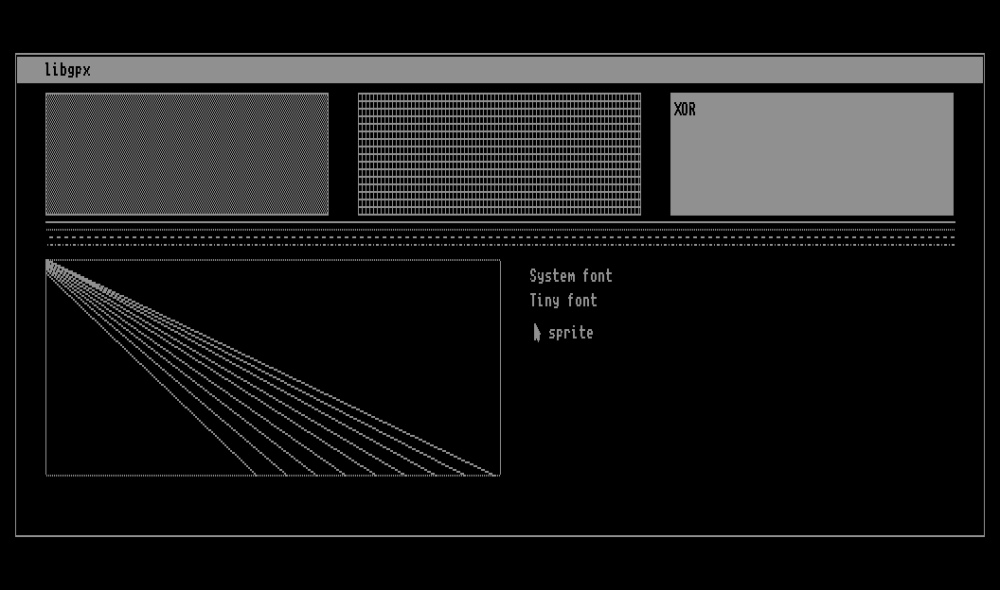
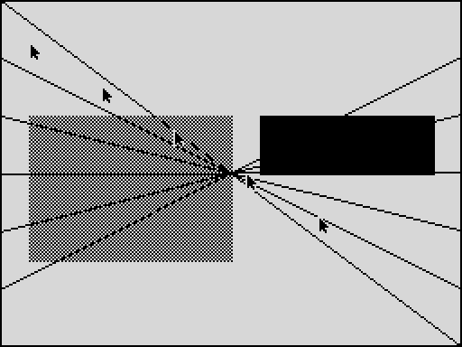
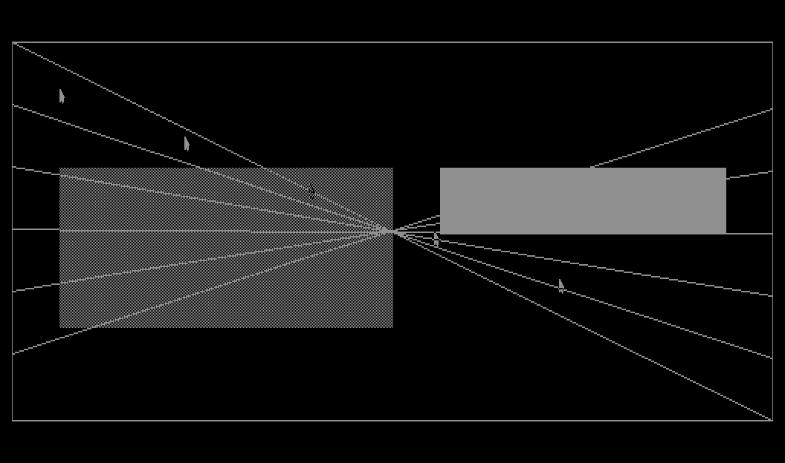
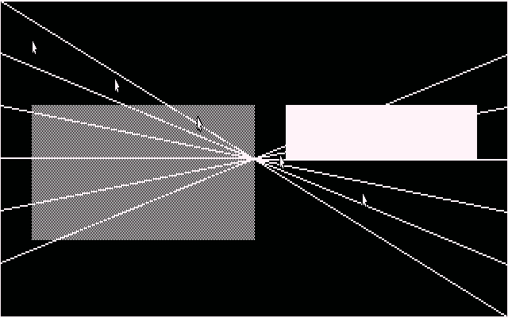

# Programming with libgpx

libgpx is a 1-bit-per-pixel graphics library for Z80 machines, written
entirely in hand-optimised assembly. It gives you pixels, lines,
rectangles, pattern fills, text and sprites behind one API that behaves
the same on every supported machine.

Three backends ship today:

| Machine | Screen | Backend | Notes |
|---|---|---|---|
| ZX Spectrum 48K | 256 x 192 | `src/zx` | packed framebuffer at 0x4000 |
| Iskra Delta Partner | 1024 x 256 or 1024 x 512 | `src/partner` | EF9367 drawing processor |
| Amstrad CPC | 640 x 200 or 320 x 200 | `src/cpc` | bank-interleaved framebuffer at 0xC000 |

The machines could hardly be less alike. The Spectrum has a bitmap you
can read and write; the Partner has a graphics coprocessor and display
memory the CPU cannot read at all; the CPC splits its framebuffer into
eight interleaved banks and changes how many pixels fit in a byte when
you change display mode. libgpx hides that: the same program produces
the same picture on all of them.

---

## Contents

1. [Getting started](#1-getting-started)
2. [Core concepts](#2-core-concepts)
3. [Function reference](#3-function-reference)
4. [Complete programs](#4-complete-programs)
5. [Building and running the examples](#5-building-and-running-the-examples)
6. [Where the backends differ](#6-where-the-backends-differ)
7. [The Amstrad CPC's two display modes](#7-the-amstrad-cpcs-two-display-modes)
8. [Appendix: Partner drawing costs](#8-appendix-partner-drawing-costs)

---

## 1. Getting started

Everything builds inside pinned Docker images, so you need no host
toolchain — only Docker. The images carry the X Tools Z80 toolchain
(`xcc`, `xas`, `xld`, `xar`, `xprog`) and an emulator for the machine.

| Machine | Image |
|---|---|
| ZX Spectrum | `wischner/xcc-z80-zx-spectrum` |
| Iskra Delta Partner | `wischner/xcc-z80-idp` |

Build the libraries:

```bash
make lib           # bin/libgpx.lib          (ZX Spectrum)
make partner-lib   # bin/partner/libgpx.lib  (Partner)
```

A minimal program:

```c
#include "libgpx.h"

void main(void)
{
    gpx_t *gpx = gpx_create(GPXM_DEFAULT);
    rect_t r = {10, 10, 100, 60};

    gpx_clrscr();
    gpx_draw_rectangle(gpx, &r, CO_FORE, BM_CPY, 0xFF, 0);
    gpx_draw_text(gpx, 14, 14, "hello", gpx_get_system_font(),
                  CO_FORE, BM_CPY, 0);
    gpx_destroy(gpx);
}
```

Compile and link it for the ZX Spectrum:

```bash
docker run --rm -u $(id -u):$(id -g) -v "$PWD":/work -w /work \
    wischner/xcc-z80-zx-spectrum sh -lc '
        xas -o build/crt0.rel samples/demo3/src/crt0-zx.s
        xcc -mz80 -std=c11 -Os -Iinclude -c -o build/hello.rel hello.c
        xcc -mz80 -nostartfiles -o build/hello.bin \
            build/crt0.rel build/hello.rel bin/libgpx.lib \
            -Wl,--oformat=binary -Wl,-b,_CODE=0x8000
        xprog --tap build/hello.bin -o bin/hello.tap \
            -n hello --load-address 32768 --entry 32768'
```

and for the Partner, where programs are CP/M `.com` files loaded at
`0x100`:

```bash
docker run --rm -u $(id -u):$(id -g) -v "$PWD":/work -w /work \
    wischner/xcc-z80-idp sh -lc '
        xas -o build/crt0.rel samples/demo3/src/crt0-partner.s
        xcc -mz80 -std=c11 -Os -Iinclude -c -o build/hello.rel hello.c
        xcc -mz80 -nostartfiles -o bin/hello.com \
            build/crt0.rel build/hello.rel bin/partner/libgpx.lib \
            -Wl,--oformat=binary -Wl,-b,_CODE=0x100'
```

Only three things change between the two: the image, the library, and
the load address. The C source is identical.

---

## 2. Core concepts

### Coordinates

The origin is the top-left pixel; x runs right and y runs down.
Coordinates are `coord`, a **signed** 16-bit type, so a shape may sit
partly or wholly off-screen and every function will clip it correctly.
Screen dimensions are `dim`, unsigned 16-bit.

Never hard-code the screen size. Ask for it:

```c
dim w = gpx_width();
dim h = gpx_height();
```

### Colour

In a 1bpp world there are two colours:

| Constant | Value | Meaning |
|---|---|---|
| `CO_FORE` | `0x01` | set the pixel (ink) |
| `CO_BACK` | `0x00` | clear the pixel (paper) |

### Blit mode

| Constant | Value | Meaning |
|---|---|---|
| `BM_CPY` | `0x00` | write the colour |
| `BM_XOR` | `0x01` | invert the existing pixel |

`BM_XOR` **ignores the colour argument** — it always inverts. This is
what makes XOR drawing reversible: draw the same thing twice and the
screen is back exactly as it was.

### Clipping

Every drawing function takes a final `const rect_t *clip`. Pass `0` for
no clipping (the screen edges still apply). Rectangles are **inclusive**
on all four corners, so `{0, 0, 9, 9}` is ten pixels wide.

Clipping never changes the pixels you get — a clipped shape lights
exactly the pixels it would have lit unclipped, minus the ones outside
the window. That matters for patterns: a clipped dashed line keeps the
phase it would have had, rather than restarting the pattern at the
window edge.

### Patterns

There are two kinds, and they read in opposite directions. This is
deliberate and worth learning once:

**Line patterns** (`lpatt`, one byte) apply **one bit per pixel, LSB
first**, from the line's start point. `0xFF` is solid. `gpx_draw_line`
returns the pattern rotated by however many pixels it drew, so you can
chain segments and keep the dashes continuous:

```c
uint8_t p = 0xF0;
p = gpx_draw_line(gpx, 0,  0, 50,  0, CO_FORE, BM_CPY, p, 0);
p = gpx_draw_line(gpx, 50, 0, 50, 40, CO_FORE, BM_CPY, p, 0);  /* continues */
```

**Fill patterns** (`fpatt`, an array) apply **MSB first from the
rectangle's left edge**, one array byte per row from its top edge — the
same way the bits of a bitmap read. Both are measured on the unclipped
rectangle, so clipping a fill never shifts its pattern.

```c
static uint8_t half[2]  = {0xAA, 0x55};                  /* 50% grey */
static uint8_t brick[4] = {0xFF, 0x88, 0x88, 0x88};      /* brickwork */
```

### The context

`gpx_create()` returns a `gpx_t *` describing the display:

```c
struct gpx_s {
    dim     width;             /* pixels across */
    dim     height;            /* pixels down */
    uint8_t pages;             /* framebuffer pages available */
    textbg  text_background;   /* opaque or transparent text */
};
```

Every drawing call takes it as its first argument. Create it once at
start-up and destroy it on the way out.

---

## 3. Function reference

### Lifecycle

---

#### `gpx_create`

```c
gpx_t *gpx_create(gmode mode);
```

Initialise the graphics hardware and return the drawing context.

| Parameter | Description |
|---|---|
| `mode` | `GPXM_DEFAULT` (0) for the machine's normal screen. Higher numbers are platform-specific: the Partner takes `1` for its 1024x512 layout; the ZX Spectrum has one mode and ignores the argument. |

**Returns** a pointer to a `gpx_t`. It is statically allocated inside the
library, so never free it.

**Notes.** Call this before any other drawing function. On the Partner it
also programs the GDP board's PIO, so the library works on a bare
machine as well as under CP/M. Read the geometry back from the returned
struct rather than assuming it.

```c
gpx_t *gpx = gpx_create(GPXM_DEFAULT);
```

---

#### `gpx_destroy`

```c
void gpx_destroy(gpx_t *gpx);
```

Release the graphics subsystem.

**Notes.** The context is static, so this frees nothing; it exists so
your program has a tidy shutdown point and so the API stays the same if
a future backend does need to release something. Call it once at the
end.

---

#### `gpx_width`, `gpx_height`

```c
dim gpx_width(void);
dim gpx_height(void);
```

Current display size in pixels. Use these instead of constants and the
same program will lay itself out correctly on both machines.

---

#### `gpx_set_page`

```c
void gpx_set_page(uint8_t op, uint8_t page);
```

Select the displayed page, the page being drawn into, or both.

| Parameter | Description |
|---|---|
| `op` | `PG_DISPLAY`, `PG_WRITE`, or both OR-ed together |
| `page` | usually 0 or 1 |

**Notes.** For double buffering: draw into the hidden page, then flip.
Only meaningful where `gpx_t.pages` is greater than 1 — the Partner has
two pages, the ZX Spectrum has one and this call does nothing there. A
display flip waits for vertical blank so the change does not tear.

```c
gpx_set_page(PG_WRITE, 1);          /* draw off-screen */
/* ... draw the next frame ... */
gpx_set_page(PG_DISPLAY, 1);        /* show it */
```

---

### Drawing

---

#### `gpx_clrscr`

```c
void gpx_clrscr(void);
```

Clear the page currently being drawn into.

**Notes.** On the Partner this is by far the most expensive single
operation — the chip scans the whole display, taking two video fields,
roughly 130,000 T-states. The library issues it and returns immediately,
so anything your program does next runs while the clear is still going.
Take advantage of that: prepare the next frame's data straight after
calling it rather than drawing at once.

---

#### `gpx_draw_pixel`

```c
void gpx_draw_pixel(gpx_t *gpx, coord x, coord y,
                    color c, bmode m, const rect_t *clip);
```

Set, clear or invert one pixel.

| Parameter | Description |
|---|---|
| `x`, `y` | position; off-screen values are simply ignored |
| `c` | `CO_FORE` or `CO_BACK` |
| `m` | `BM_CPY` or `BM_XOR` (ignores `c`) |
| `clip` | window rect, or `0` |

**Notes.** This is the slowest way to fill an area — every call carries
the full clip test. Reach for `gpx_draw_line` or `gpx_fill_rectangle`
whenever the shape allows it.

---

#### `gpx_draw_line`

```c
uint8_t gpx_draw_line(gpx_t *gpx, coord x0, coord y0, coord x1, coord y1,
                      color c, bmode m, uint8_t lpatt, const rect_t *clip);
```

Draw a line using Bresenham's algorithm.

| Parameter | Description |
|---|---|
| `x0`, `y0` | start point |
| `x1`, `y1` | end point, inclusive |
| `c` | `CO_FORE` or `CO_BACK` |
| `m` | `BM_CPY` or `BM_XOR` |
| `lpatt` | dash pattern, one bit per pixel LSB first; `0xFF` is solid |
| `clip` | window rect, or `0` |

**Returns** the pattern rotated by the number of pixels drawn, ready to
pass to the next segment so a dashed outline stays continuous around
corners.

**Notes.** Horizontal and vertical lines take a fast path and are much
cheaper than diagonals — prefer them when you have the choice. On the
Partner a solid line is handed to the EF9367's vector generator, which
is quick; any other pattern is walked pixel by pixel.

```c
/* a dashed box whose pattern runs continuously around all four sides */
uint8_t p = 0xF0;
p = gpx_draw_line(gpx, 10, 10, 90, 10, CO_FORE, BM_CPY, p, 0);
p = gpx_draw_line(gpx, 90, 10, 90, 50, CO_FORE, BM_CPY, p, 0);
p = gpx_draw_line(gpx, 90, 50, 10, 50, CO_FORE, BM_CPY, p, 0);
p = gpx_draw_line(gpx, 10, 50, 10, 10, CO_FORE, BM_CPY, p, 0);
```

---

#### `gpx_draw_rectangle`

```c
void gpx_draw_rectangle(gpx_t *gpx, rect_t *r,
                        color c, bmode m, uint8_t lpatt, const rect_t *clip);
```

Draw a rectangle outline. Corners are inclusive.

**Notes.** All four sides are horizontal or vertical, so this is cheap.
The pattern runs continuously around the outline.

---

#### `gpx_fill_rectangle`

```c
void gpx_fill_rectangle(gpx_t *gpx, rect_t *r, color c, bmode m,
                        uint8_t *fpatt, uint8_t fpatt_len,
                        const rect_t *clip);
```

Fill a rectangle with a repeating pattern.

| Parameter | Description |
|---|---|
| `r` | area to fill, corners inclusive |
| `fpatt` | pattern bytes, applied MSB first from `r->x0` |
| `fpatt_len` | number of bytes; row *n* uses `fpatt[n % fpatt_len]` |

**Notes.** Both the row index and the bit position are measured from the
unclipped rectangle, so a partly-clipped fill lines up seamlessly with
an unclipped one beside it. Pass a one-byte `{0xFF}` for a solid block.
This is the fastest way to cover an area.

```c
static uint8_t solid[1] = {0xFF};
static uint8_t half[2]  = {0xAA, 0x55};

gpx_fill_rectangle(gpx, &panel, CO_FORE, BM_CPY, half, 2, 0);
gpx_fill_rectangle(gpx, &bar,   CO_FORE, BM_CPY, solid, 1, 0);
```

---

#### `gpx_draw_bmp`

```c
void gpx_draw_bmp(gpx_t *gpx, coord x, coord y, bmp_t *b,
                  const rect_t *clip);
```

Blit a bitmap with its top-left corner at (`x`, `y`).

**Notes.** The payload format is machine-specific — see [Where the
backends differ](#6-where-the-backends-differ). Use
`gpx_get_stock_bmp()` for artwork that must work on both. Note there is
no colour or blit-mode argument: bitmaps always draw in copy mode with
the colours their own payload specifies.

---

### Circles

The two circle primitives are **advanced** functions: they are in the
library a plain `make` produces, but a library built with `ADVANCED=0`
stops at the core set and these will not link. See [Building and running
the examples](#5-building-and-running-the-examples).

Unlike everything above they are not written per machine. One portable
module drives each backend through `gpx_draw_pixel` and
`gpx_fill_rectangle`, so all three machines get the same circle by
construction rather than by three implementations agreeing.

#### `gpx_draw_circle`

```c
void gpx_draw_circle(gpx_t *gpx, coord x, coord y, coord r,
                     color c, bmode m, const rect_t *clip);
```

Draw the outline of the circle centred on (`x`, `y`) with radius `r`,
using the midpoint (Bresenham) stepper.

| Parameter | Description |
|---|---|
| `x`, `y` | centre, which may be off screen |
| `r` | radius in pixels; `0` is a single pixel, negative draws nothing |

**Notes.** Every pixel is plotted exactly once, so `BM_XOR` behaves and
drawing the same circle twice in XOR erases it. There is no `lpatt`
argument: the outline is emitted eight octant points at a time rather
than walked end to end, so a per-pixel pattern phase would have no
meaning. For a dashed ring, draw into a scratch page or use
`gpx_draw_line` segments.

```c
gpx_draw_circle(gpx, 128, 96, 40, CO_FORE, BM_CPY, 0);
gpx_draw_circle(gpx, 128, 96, 40, CO_FORE, BM_XOR, 0);  /* and gone again */
```

---

#### `gpx_fill_circle`

```c
void gpx_fill_circle(gpx_t *gpx, coord x, coord y, coord r,
                     color c, bmode m,
                     uint8_t *fpatt, uint8_t fpatt_len,
                     const rect_t *clip);
```

Fill the disc centred on (`x`, `y`) with radius `r`, with the same kind
of repeating pattern `gpx_fill_rectangle` takes.

| Parameter | Description |
|---|---|
| `fpatt` | pattern bytes, applied MSB first from the left edge of the circle's bounding box |
| `fpatt_len` | number of bytes; row *n* of the box uses `fpatt[n % fpatt_len]` |

**Notes.** The pattern is anchored to the bounding box, not to each row,
so the pattern runs straight down the disc instead of stepping in and
out with the row width — and a disc and a rectangle filled with the same
pattern lay down the same bits where they overlap. Both are measured
before clipping, exactly as for a rectangle.

The disc is bounded by the pixels `gpx_draw_circle` plots for the same
centre and radius, so the outline lands on the disc's own edge and the
two combine into a filled circle with a contrasting rim. Every row is
painted once, so `BM_XOR` behaves here too.

```c
static uint8_t solid[1] = {0xFF};
static uint8_t half[2]  = {0xAA, 0x55};

gpx_fill_circle(gpx, 60, 96, 40, CO_FORE, BM_CPY, half, 2, 0);

gpx_fill_circle(gpx, 180, 96, 40, CO_FORE, BM_CPY, solid, 1, 0);
gpx_draw_circle(gpx, 180, 96, 40, CO_BACK, BM_CPY, 0);
```

---

### Polygons

Also **advanced**, and also one portable module rather than three: both
functions drive the backend through `gpx_draw_line`, so every machine gets
the same polygon.

#### `gpx_draw_polygon`

```c
void gpx_draw_polygon(gpx_t *gpx, point_t *pts, uint8_t n,
                      color c, bmode m, uint8_t lpatt,
                      const rect_t *clip);
```

Draw the closed path through `pts[0..n-1]`.

| Parameter | Description |
|---|---|
| `pts` | vertices; the path closes from the last back to the first |
| `n` | number of points; fewer than two draws nothing |
| `lpatt` | dash pattern, carried from each edge into the next |

**Notes.** The rotated pattern is chained edge to edge, so a dashed
outline runs continuously around the corners the way it does around a
rectangle. Each vertex belongs to two edges and so is painted twice: in
`BM_XOR` that leaves the corners uninverted, although drawing the whole
outline twice still restores the background exactly.

---

#### `gpx_fill_polygon`

```c
void gpx_fill_polygon(gpx_t *gpx, point_t *pts, uint8_t n,
                      color c, bmode m,
                      uint8_t *fpatt, uint8_t fpatt_len,
                      const rect_t *clip);
```

Fill the closed path through `pts[0..n-1]`, one horizontal run per
scanline, using the even-odd rule.

| Parameter | Description |
|---|---|
| `n` | 3 to `GPX_MAX_POLY_PTS` points; anything else fills nothing |
| `fpatt` | pattern bytes, MSB first from the left edge of the bounding box |
| `fpatt_len` | number of bytes; row *n* of the box uses `fpatt[n % fpatt_len]` |

**Notes.** The polygon may be concave or self-intersecting, and the points
may be given in either winding order — even-odd empties the crossing of a
bowtie and the middle of a five-pointed star. As with a filled circle the
pattern is anchored to the bounding box, so it runs straight through the
shape instead of stepping with the edges, and a rectangle filled as a
polygon lays down the same bits `gpx_fill_rectangle` would.

The spans end exactly on the pixels `gpx_draw_polygon` paints for the same
points, so a dithered fill can be closed with a solid rim. Getting that
right is most of what the module does: an edge the path runs *up* has to
be walked *down* to fill it, this Bresenham is not symmetric under
reversal, and so a flipped edge is walked with the opposite rounding bias.

Every pixel is painted at most once, so `BM_XOR` behaves. Two spans that
meet on a shared vertex hand the pixel to the first of them.

**Cost.** The edge table lives on the stack: about 250 bytes while the
call is running, 17 of them per point. That is the reason for
`GPX_MAX_POLY_PTS`, which is 12. Raising it means editing `MAXPTS` in
`src/common/gpx_fill_polygon.s` and the constant in `libgpx.h` together.

```c
static uint8_t solid[1] = {0xFF};
static point_t arrow[7];

/* ... fill in the vertices ... */
gpx_fill_polygon(gpx, arrow, 7, CO_FORE, BM_CPY, solid, 1, 0);
gpx_draw_polygon(gpx, arrow, 7, CO_BACK, BM_CPY, 0xFF, 0);
```

---

### Text

---

#### `gpx_get_system_font`, `gpx_get_tiny_font`

```c
const font_t *gpx_get_system_font(void);
const font_t *gpx_get_tiny_font(void);
```

The machine's default UI font and its small font. Never `NULL`.

**Notes.** The fonts are different assets on each machine — the ZX ships
an 8-pixel raster face, the Partner an Unscii-8 vector face — so text will
not be pixel-identical across backends. Read `glyph_height` and
`advance` from the returned `font_t` instead of assuming a size:

```c
const font_t *f = gpx_get_system_font();
coord line_spacing = (coord)(f->glyph_height + 2);
```

Note the difference between the two: `glyph_height` is the cell height,
used for line spacing; `advance` is the gap *between characters*.

---

#### `gpx_set_text_background`

```c
void gpx_set_text_background(gpx_t *gpx, textbg background);
```

Choose how subsequent text calls treat pixels outside the glyph ink.

| `background` | Effect |
|---|---|
| `GPX_TEXT_BG_OPAQUE` | Clear the glyph box and character spacing to the inverse text color before/while copying glyph ink. This is the default. |
| `GPX_TEXT_BG_TRANSPARENT` | Draw glyph ink only and preserve the existing glyph background and spacing. |

The setting belongs to the graphics context and remains active until it is
changed or `gpx_create()` is called again. For example, text over artwork can
be left transparent without changing its font, color, or dimensions:

```c
gpx_set_text_background(gpx, GPX_TEXT_BG_TRANSPARENT);
gpx_draw_text(gpx, 20, 20, "overlay", font,
              CO_FORE, BM_CPY, 0);
```

---

#### `gpx_measure_text`

```c
coord gpx_measure_text(const char *text, const font_t *font);
```

Width in pixels the string would occupy. Use it to centre or right-align
text without drawing it first.

```c
coord tw = gpx_measure_text(title, font);
gpx_draw_text(gpx, (coord)((gpx_width() - tw) / 2), 4, title, font,
              CO_FORE, BM_CPY, 0);
```

**Notes.** Costs no drawing time at all, so it is safe to call
immediately after `gpx_clrscr()` while the screen clear is still running
on the Partner.

---

#### `gpx_draw_text`

```c
void gpx_draw_text(gpx_t *gpx, coord x, coord y,
                   const char *text, const font_t *font,
                   color c, bmode m, const rect_t *clip);
```

Draw a NUL-terminated string with its top-left corner at (`x`, `y`).

| Parameter | Description |
|---|---|
| `c` | `CO_FORE` for normal, `CO_BACK` for reverse video |
| `m` | `BM_CPY`, or `BM_XOR` to invert whatever is underneath |

**Notes.** Text starts in `GPX_TEXT_BG_OPAQUE` mode. With `BM_CPY`, the
glyph box and character spacing are painted in the opposite color, so
drawing over existing artwork replaces it rather than merging with it.
Use `gpx_set_text_background()` to select transparent overlays. `BM_XOR`
always toggles glyph ink only; opaque mode still paints character spacing
for compatibility, while transparent mode leaves all spacing untouched.

---

### Sprites

---

#### `gpx_show_sprite`, `gpx_hide_sprite`

```c
void gpx_show_sprite(gpx_t *gpx, sprite_t *sprite);
void gpx_hide_sprite(gpx_t *gpx, sprite_t *sprite);
```

Draw a sprite, and put back exactly what was underneath it.

```c
typedef struct sprite_s {
    coord         x, y;
    bmp_t        *bitmap;      /* the artwork */
    bmp_t        *background;  /* save-under storage */
    const rect_t *clip;        /* window, or NULL */
} sprite_t;
```

| Field | Description |
|---|---|
| `bitmap` | the image; use `gpx_get_stock_bmp()` for portable artwork |
| `background` | writable storage of at least `GPX_SPRITE_BG_SIZE` bytes |
| `clip` | window rect, or `0` for the whole screen |

**Notes — read these before using sprites.**

*Always supply `background`.* The ZX saves the pixels under the sprite
into it. The Partner never touches it — it has no readable display
memory and XOR-draws the sprite instead, which undoes itself when drawn
a second time — but a portable program must still provide the buffer:

```c
static uint8_t under[GPX_SPRITE_BG_SIZE];
sprite.background = (bmp_t *)under;
```

*Keep the descriptor unchanged between show and hide.* Both calls read
`x`, `y`, `bitmap` and `clip` from it. Move the sprite by hiding it,
then changing `x`/`y`, then showing it again — never by changing the
coordinates first.

*One sprite per background buffer.* The buffer holds one saved
rectangle, so each simultaneously-visible sprite needs its own.

```c
static uint8_t under[GPX_SPRITE_BG_SIZE];
sprite_t cursor;

cursor.bitmap     = gpx_get_stock_bmp(GPXSB_CURSOR_CLASSIC);
cursor.background = (bmp_t *)under;
cursor.clip       = 0;
cursor.x = 100; cursor.y = 50;

gpx_show_sprite(gpx, &cursor);      /* on screen */
gpx_hide_sprite(gpx, &cursor);      /* background restored exactly */
cursor.x += 8;
gpx_show_sprite(gpx, &cursor);      /* moved */
```

---

#### `gpx_get_stock_bmp`

```c
bmp_t *gpx_get_stock_bmp(const uint8_t which);
```

Built-in artwork in whatever format the current machine needs, so it is
the portable way to get a bitmap.

| Id | Image |
|---|---|
| `GPXSB_CURSOR_CLASSIC` | arrow pointer |
| `GPXSB_CURSOR_STD` | alternate pointer |
| `GPXSB_CURSOR_HOURGLASS` | busy indicator |
| `GPXSB_CURSOR_CARET` | text caret |
| `GPXSB_CURSOR_HAND` | hand pointer |

**Returns** the bitmap, or `NULL` if the id is not supported. All five
are available on every backend today.

---

## 4. Complete programs

### Demo directory reference

Every demo is built from the same C source for all three backends. The
illustrated pages below document their intent, expected output, build
products, source layout, and the differences visible between the Spectrum,
Partner and CPC captures.

| Demo | Reference | Main API focus | Layout strategy |
|---|---|---|---|
| 1 | [screen dimensions and stock cursors](../../samples/demo1/README.md) | dimensions, fill, text, stock bitmaps, sprite show/hide | fixed 256x192; exposes unused Partner screen area |
| 2 | [full-API smoke test](../../samples/demo2/README.md) | measurement, lines, patterns, clipping, text, rectangles, sprites | fixed 1024x256; exposes Spectrum screen clipping |
| 3 | [portable example programs](../../samples/demo3/README.md) | portable layouts and the complete drawing/sprite workflow | derives coordinates from `gpx_width()` and `gpx_height()` |
| 4 | [circles and filled circles](../../samples/demo4/README.md) | the advanced primitives: outlines, pattern fills, XOR, clipping | derives coordinates from `gpx_width()` and `gpx_height()`; needs an `ADVANCED` library |
| 5 | [polygons](../../samples/demo5/README.md) | polygon outlines and even-odd fills, concave and self-intersecting | unit shapes scaled into cells; needs an `ADVANCED` library |

Both programs are in [`samples/demo3/src/`](../../samples/demo3/src/)
and build for either machine from the same source. Neither hard-codes a
screen size — every coordinate comes from `gpx_width()` and
`gpx_height()`, which is why the same code lays itself out sensibly on a
256x192 Spectrum and a 1024x256 Partner.

### Example 1 — panels

[`panels.c`](../../samples/demo3/src/panels.c) draws a static screen
that exercises most of the API: a framed layout, reverse-video title,
three pattern fills, four line styles, a clipped fan of rays, both
fonts, and a cursor sprite.

ZX Spectrum:


Iskra Delta Partner:



Reading the picture: the title bar is a solid fill with the caption in
`CO_BACK`. The three panels use `{0xAA,0x55}`, `{0xFF,0x88,0x88,0x88}`
and `{0xFF}`. The `XOR` caption on the third one is drawn with `BM_XOR`
— note how it inverts the gaps between the letters as well as the
glyphs, which is why `CO_BACK` is the better choice for the title. The
four rules underneath are `0xFF`, `0xAA`, `0xF0` and `0xE4`. The rays
are all drawn from a point outside the box and clipped to it.

### Example 2 — bounce

[`bounce.c`](../../samples/demo3/src/bounce.c) demonstrates the sprite
contract. A cursor is walked across busy artwork; every fourth position
is left on screen and the rest are hidden again.

ZX Spectrum:



Iskra Delta Partner:



The trail proves the sprite was drawn at each step. What matters more is
what you *cannot* see: the half-tone slab, the solid block and the
hairlines are exactly as the background routine drew them. Every hidden
position restored its pixels perfectly — including where the sprite
straddled the edge of the slab, and including on the Partner, which
achieves it without ever reading the screen.

---

## 5. Building and running the examples

### The `ADVANCED` switch

A plain `make lib` (or `partner-lib`, or `cpc-lib`) builds the whole
library, advanced primitives included. Building with `ADVANCED=0` — `no`
and `false` also work, in any case — stops at the core set:

```bash
make lib                # everything, the default
make ADVANCED=0 lib     # core primitives only
```

[The circle functions](#circles) and [the polygon
functions](#polygons) are the advanced ones today. Turning them
off is not usually worth it: the library is an archive, so the linker
already leaves out any module a program does not call, and a program that
never draws a circle pays nothing either way. The switch is there for
builds that want the library itself to be exactly the core set — and a
program that does call a circle function will fail to link against one,
with an unresolved `_gpx_draw_circle` or `_gpx_fill_circle`.

Changing the setting rebuilds the objects on the next `make`; there is no
need to `make clean` in between.

### Samples

```bash
make -C samples/demo1 build        # demo1.tap and demo1.com
make -C samples/demo2 build        # demo2.tap and demo2.com
make -C samples/demo3 build        # panels/bounce as .tap and .com
make -C samples/demo4 build        # circles as .tap and .com
make -C samples/demo5 build        # polygons as .tap and .com

make -C samples/demo1 zx           # one demo, Spectrum only
make -C samples/demo1 partner      # one demo, Partner only
```

Run the ZX build in any emulator that takes a `.tap`; the repository
includes a Fuse launcher:

```bash
scripts/run/run-fuse-demo1.sh bin/demo3/panels.tap
```

For the Partner, put the `.com` on a CP/M disk image and run it under
`idp-emu` from the `wischner/xcc-z80-idp` image.

All demo screenshots are generated, not hand-captured. To reproduce them,
which also confirms that every program runs on every backend:

```bash
python3 scripts/docs/capture-manual-shots.py
```

That builds every sample against all three backends -- the CPC twice, once
per display mode -- drives the headless Spectrum, Partner and CPC emulators
over MCP, and writes twenty-four PNGs into
`docs/images/screenshots/`.

---

## 6. Where the backends differ

The backends are held to identical output by a conformance test that
compiles one program for each backend, runs it on every emulator, and
compares the rasters against the ZX pixel for pixel:

```bash
make conformance
```

The Amstrad CPC is compared in **both** display modes and is allowed no
differences at all: it shares the ZX's font, its stock cursors and its
software rasteriser, so anything but an exact match is a bug. Only the
Partner has documented exceptions, and there are exactly three of them.

**Bitmap and font payloads.** The ZX takes packed rasters; the Partner
takes vector move-streams, because its coprocessor draws strokes rather
than blitting pixels. Artwork and glyphs therefore differ by design. Use
`gpx_get_stock_bmp()` and the stock fonts for anything that must work on
both, and keep machine-specific artwork behind your own `#if`.

**Slanted solid lines** differ by about one pixel along their length,
because the Partner hands them to the EF9367's own vector generator,
which chooses its interior pixels differently from a software Bresenham.
Endpoints, clipping and every pattern still match exactly. Drawing them
in software instead would be pixel-perfect but measured 84 times slower,
so speed won.

**Screen geometry**, obviously — which is why you should never hard-code
a size.

Everything else is guaranteed: colours, blit modes, clipping decisions
and boundaries, line pattern shapes and phase, the pattern chaining
return value, fill pattern anchoring, and the sprite show/hide contract.

---

---

## 7. The Amstrad CPC's two display modes

The CPC is the one machine here that can change its screen geometry, and
**one library serves both modes**. Choose with the argument to
`gpx_create()`:

```c
gpx_t *gpx = gpx_create(GPXM_CPC_640X200);   /* two colours, 640 x 200 */
gpx_t *gpx = gpx_create(GPXM_CPC_320X200);   /* wider pixels, 320 x 200 */
```

`GPXM_DEFAULT` is 640 x 200. `gpx_create()` programs the CRTC and the
Gate Array to match, so a libgpx program runs from a raw binary at
`0x8000` with both ROMs paged out and the firmware never involved. After
that, `gpx_width()` reports the mode you picked and everything else in
this manual behaves identically.

The two modes are not the same picture at different sizes: a mode 2 byte
holds eight pixels, a mode 1 byte holds four, and libgpx draws in pen 1,
which lives in the high nibble. That is invisible through the API — but
it is why a program should derive its layout from `gpx_width()` and
`gpx_height()` rather than assume either geometry.

The same source, `samples/demo3/src/panels.c`, in both modes:

640 x 200


320 x 200


And `bounce`, which shows sprite save-under over patterned backgrounds:

640 x 200



320 x 200


The CPC's own test suite runs every scenario twice, once per mode, and
compares against golden rasters read straight out of display memory:

```bash
make cpc-tests       # golden rasters, both modes
make cpc-bench       # T-states per primitive, both modes
make lib-size ARGS="--backend cpc"
```

Three behaviours are worth knowing about.

`gpx_draw_line()` picks one of eight hand-written raster loops before it
draws a pixel. The x-major loops are specialised on x direction and display
mode, the y-major ones on y direction and display mode, because all four of
those are fixed for the whole line. That takes the mask-advance call, its
return, and a per-pixel read of the mode variable out of the inner loop
entirely, and it is worth about **20%** on shallow lines and **25%** on
steep ones, for 362 bytes of code.

`gpx_clrscr()` clears the 16 KiB framebuffer
through the stack pointer, because CPC memory timing rounds every
instruction up to four T-states and that makes `push` cost twelve T-states
for two bytes where a store-and-increment pair costs twelve for one. It is
the largest single write the library makes, and this halves it. Interrupts
are therefore masked while SP points at the screen; the caller's interrupt
state is saved and restored around it rather than assumed.

`gpx_fill_rectangle()` uses the same trick for the solid part of a long row,
which is why a large flat fill is roughly twice the throughput of a
patterned one. The stack is only parked for runs of sixteen bytes or more --
below that the setup costs more than it saves -- and never for more than one
row at a time, so the window with interrupts masked stays around 500
T-states. As with `gpx_clrscr()`, the caller's interrupt state is preserved
either way, so a caller that had interrupts off keeps them off.

---

## 8. Appendix: Partner drawing costs

Worth knowing if you are tuning a program for the Partner. The EF9367 draws
while the CPU carries on, and libgpx is built to exploit that: it waits for
the chip only when it next has to touch a register, never straight after
issuing a command. So anything your program can do in less time than the
drawing it just started is effectively free.

The chip's clock on the Partner is the 24 MHz video crystal divided by 16 =
**1.5 MHz**, so one of its cycles is 8/3 = **2.667 Z80 T-states** at 4 MHz.
Page references are to the SGS-Thomson EF9367 datasheet.

| Operation | Chip cycles | T-states @ 4 MHz |
|---|---|---|
| Command write synchronisation [6-66] | <= 2 | <= 5 |
| Vector, incl. sync, init and both endpoints [6-66, 6-67] | 4 + max(\|dx\|,\|dy\|) + 1 | 2.67 x that |
| Single dot (dx = dy = 0) [6-67] | 5 | ~13 |
| Vector, 255 px | 260 | ~693 |
| Vector, 880 px | 885 | ~2 360 |
| Character, unscaled 5x8 cell [6-68] | 6P x 8Q = 48 | ~128 |
| Screen clear [6-62] | 50 400 + up to 25 200 wait | ~134 000 to ~201 000 |
| One 525-line field | 25 200 | ~67 000 |

Rules of thumb:

* A vector costs about **2.7 T-states per pixel** of its longer projection.
* A screen clear is **two orders of magnitude** more expensive than any
  drawing primitive. p. 6-62 says the scan lasts two frames when FMAT is high
  or tied to CK, and the Partner ties it, so it is always two fields — in
  1024x256 as much as in 1024x512 — plus up to another field waiting for the
  vertical blank to come round. Issue it and do something useful; do not
  block on it.
* Splitting a long vector into halves for the 8-bit delta registers costs
  almost nothing beyond the dots themselves, since the per-command overhead
  is only about 13 T-states.

Two consequences for how you write code. Prefer horizontal and vertical
lines, which take a fast path; and prefer `gpx_fill_rectangle` over loops of
`gpx_draw_pixel`, which is the slowest thing in the library because every
call repeats the whole clip test.

The advanced primitives fall on both sides of that line, and `make
crossbench` shows it plainly. A **polygon outline** is slanted vectors, so
the Partner draws eight ten-point stars in 87 ms against the CPC's 276 --
one of its widest wins. A **circle outline** is per-pixel plotting, which
the chip cannot accelerate at all, so the same machine becomes the slowest
of the three for that one benchmark: 2,204 ms against the Spectrum's 1,668.
**Filling** either shape puts the Partner back in front, because a fill
emits one horizontal run per scanline. If a picture needs many circles on a
Partner, drawing them filled is not just cheaper than outline-plus-fill --
it is cheaper than the outline alone.

---

*libgpx is distributed under the GPL2 — see [LICENSE](../../LICENSE).*
