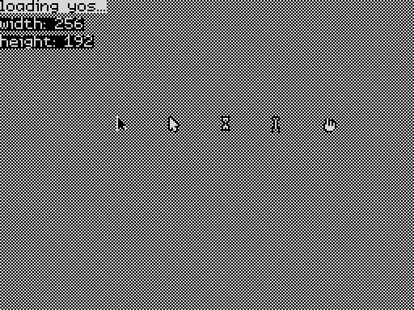
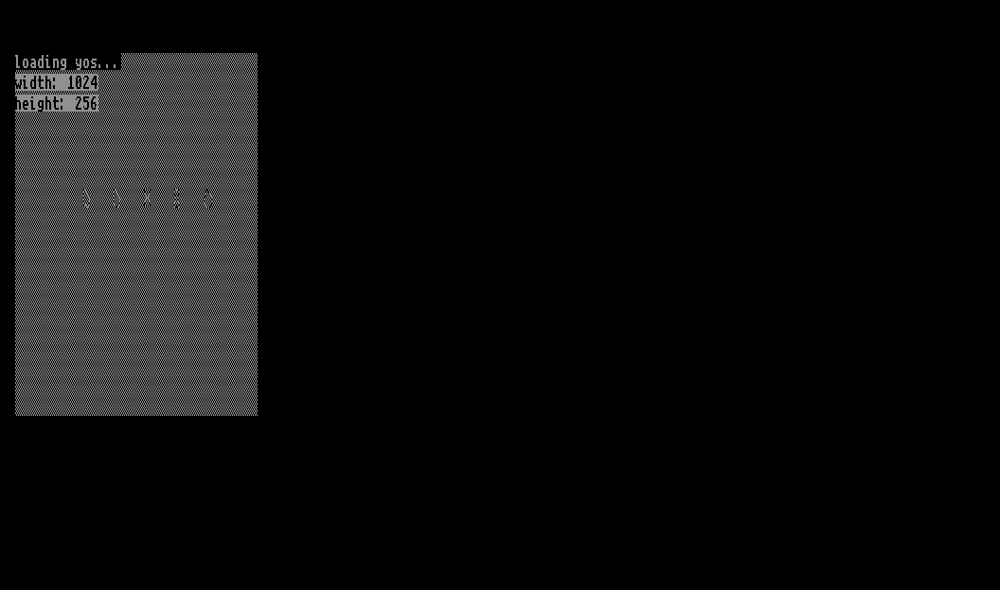
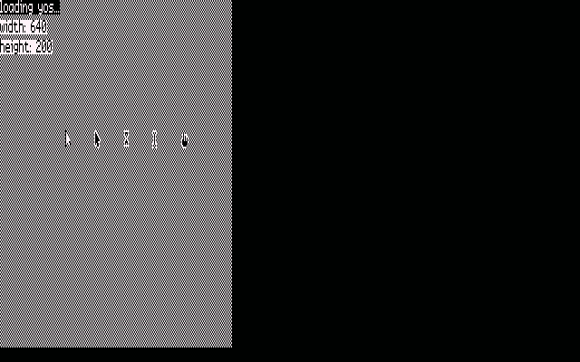
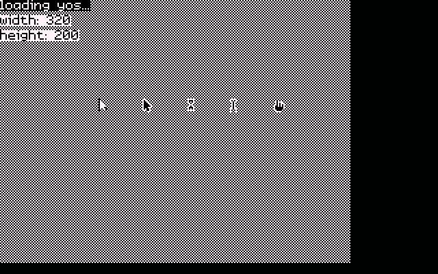

# Demo 1 — screen dimensions and stock cursors

Demo 1 is a compact stock-asset and sprite round-trip test. The same C source
runs on both supported machines, reports the dimensions returned by libgpx,
draws all five stock cursors, and proves that hiding a sprite restores the
background beneath it.

The scene deliberately fills a fixed 256x192 rectangle. That is the complete
ZX Spectrum display, but only the upper-left part of the Partner display. The
contrast makes screen geometry and backend-specific stock artwork easy to see.

## ZX Spectrum 48K



## Iskra Delta Partner



### Amstrad CPC — 640 x 200



### Amstrad CPC — 320 x 200




## What the demo exercises

- `gpx_create`, `gpx_clrscr`, `gpx_width`, and `gpx_height`
- a two-row `0xAA, 0x55` pattern fill
- system-font text in foreground and background colours
- all five `GPXSB_CURSOR_*` stock bitmaps
- `gpx_show_sprite` followed by `gpx_hide_sprite`

The first cursor row remains visible. The second row is drawn and then hidden;
its absence, with the checker pattern restored, is the sprite save-under test.
The cursor shapes are supplied by each backend, so their exact rendering is
expected to differ.

## Main program

```c
#include "libgpx.h"

static char *append_dim(char *dst, dim value)
{
    char digits[5];
    uint8_t count = 0;

    do {
        digits[count++] = (char)('0' + (value % 10));
        value /= 10;
    } while (value != 0);

    while (count > 0)
        *dst++ = digits[--count];

    *dst = '\0';
    return dst;
}

static void build_dimension_line(char *dst, const char *label, dim value)
{
    while (*label != '\0')
        *dst++ = *label++;

    *dst++ = ':';
    *dst++ = ' ';
    (void)append_dim(dst, value);
}

static uint8_t classic_bg[GPX_SPRITE_BG_SIZE];
static uint8_t std_bg[GPX_SPRITE_BG_SIZE];
static uint8_t hourglass_bg[GPX_SPRITE_BG_SIZE];
static uint8_t caret_bg[GPX_SPRITE_BG_SIZE];
static uint8_t hand_bg[GPX_SPRITE_BG_SIZE];
static uint8_t classic_bg2[GPX_SPRITE_BG_SIZE];
static uint8_t std_bg2[GPX_SPRITE_BG_SIZE];
static uint8_t hourglass_bg2[GPX_SPRITE_BG_SIZE];
static uint8_t caret_bg2[GPX_SPRITE_BG_SIZE];
static uint8_t hand_bg2[GPX_SPRITE_BG_SIZE];
static sprite_t classic_sprite = {72, 72, 0, (bmp_t *)classic_bg};
static sprite_t std_sprite = {104, 72, 0, (bmp_t *)std_bg};
static sprite_t hourglass_sprite = {136, 72, 0, (bmp_t *)hourglass_bg};
static sprite_t caret_sprite = {168, 72, 0, (bmp_t *)caret_bg};
static sprite_t hand_sprite = {200, 72, 0, (bmp_t *)hand_bg};
static sprite_t classic_sprite2 = {72, 96, 0, (bmp_t *)classic_bg2};
static sprite_t std_sprite2 = {104, 96, 0, (bmp_t *)std_bg2};
static sprite_t hourglass_sprite2 = {136, 96, 0, (bmp_t *)hourglass_bg2};
static sprite_t caret_sprite2 = {168, 96, 0, (bmp_t *)caret_bg2};
static sprite_t hand_sprite2 = {200, 96, 0, (bmp_t *)hand_bg2};

int main(void)
{
    gpx_t *gpx = gpx_create(GPXM_DEFAULT);
    const font_t *font = gpx_get_system_font();
    char width_line[16];
    char height_line[16];
    uint8_t fpatt[2] = {0xAA, 0x55};
    rect_t screen = {0, 0, 255, 191};

    gpx_clrscr();
    gpx_fill_rectangle(gpx, &screen, CO_FORE, BM_CPY, fpatt, 2, NULL);

    gpx_draw_text(gpx, 0, 0, "loading yos...", font, CO_FORE, BM_CPY, NULL);
    build_dimension_line(width_line, "width", gpx_width());
    build_dimension_line(height_line, "height", gpx_height());
    gpx_draw_text(gpx, 0, 11, width_line, font, CO_BACK, BM_CPY, NULL);
    gpx_draw_text(gpx, 0, 22, height_line, font, CO_BACK, BM_CPY, NULL);

    classic_sprite.bitmap = gpx_get_stock_bmp(GPXSB_CURSOR_CLASSIC);
    std_sprite.bitmap = gpx_get_stock_bmp(GPXSB_CURSOR_STD);
    hourglass_sprite.bitmap = gpx_get_stock_bmp(GPXSB_CURSOR_HOURGLASS);
    caret_sprite.bitmap = gpx_get_stock_bmp(GPXSB_CURSOR_CARET);
    hand_sprite.bitmap = gpx_get_stock_bmp(GPXSB_CURSOR_HAND);
    classic_sprite2.bitmap = classic_sprite.bitmap;
    std_sprite2.bitmap = std_sprite.bitmap;
    hourglass_sprite2.bitmap = hourglass_sprite.bitmap;
    caret_sprite2.bitmap = caret_sprite.bitmap;
    hand_sprite2.bitmap = hand_sprite.bitmap;

    if (classic_sprite.bitmap != NULL)
        gpx_show_sprite(gpx, &classic_sprite);
    if (std_sprite.bitmap != NULL)
        gpx_show_sprite(gpx, &std_sprite);
    if (hourglass_sprite.bitmap != NULL)
        gpx_show_sprite(gpx, &hourglass_sprite);
    if (caret_sprite.bitmap != NULL)
        gpx_show_sprite(gpx, &caret_sprite);
    if (hand_sprite.bitmap != NULL)
        gpx_show_sprite(gpx, &hand_sprite);

    if (classic_sprite2.bitmap != NULL)
        gpx_show_sprite(gpx, &classic_sprite2);
    if (std_sprite2.bitmap != NULL)
        gpx_show_sprite(gpx, &std_sprite2);
    if (hourglass_sprite2.bitmap != NULL)
        gpx_show_sprite(gpx, &hourglass_sprite2);
    if (caret_sprite2.bitmap != NULL)
        gpx_show_sprite(gpx, &caret_sprite2);
    if (hand_sprite2.bitmap != NULL)
        gpx_show_sprite(gpx, &hand_sprite2);

    if (classic_sprite2.bitmap != NULL)
        gpx_hide_sprite(gpx, &classic_sprite2);
    if (std_sprite2.bitmap != NULL)
        gpx_hide_sprite(gpx, &std_sprite2);
    if (hourglass_sprite2.bitmap != NULL)
        gpx_hide_sprite(gpx, &hourglass_sprite2);
    if (caret_sprite2.bitmap != NULL)
        gpx_hide_sprite(gpx, &caret_sprite2);
    if (hand_sprite2.bitmap != NULL)
        gpx_hide_sprite(gpx, &hand_sprite2);

    __asm__("halt");

    return 0;
}
```

`append_dim` converts an unsigned screen dimension without pulling formatted
I/O into the small Z80 binary; `build_dimension_line` prefixes that number with
its label. Ten background buffers accompany two rows of five `sprite_t`
objects. After the checker fill and dimension text are drawn, the program asks
the active backend for each stock cursor. It leaves the first row visible, then
shows and hides the second row to verify restoration. Null checks keep the demo
safe if a backend does not provide a requested stock image. The final `halt`
leaves the completed picture available to an emulator or capture tool.

## Build

From the repository root:

```bash
make -C samples/demo1 build       # both targets
make -C samples/demo1 zx          # bin/demo1/demo1.tap
make -C samples/demo1 partner     # bin/demo1/demo1.com
```

All compilation happens in the pinned Docker toolchain images. The Spectrum
program loads at `0x8000`; the Partner program is a CP/M transient program at
`0x0100`.

## Run

Load `bin/demo1/demo1.tap` in a 48K Spectrum emulator, or run
`bin/demo1/demo1.com` from CP/M on the Partner. The repository's Fuse launcher
also accepts the tape path:

```bash
scripts/run/run-fuse-demo1.sh bin/demo1/demo1.tap
```

To reproduce both screenshots through the headless MCP emulators:

```bash
python3 scripts/docs/capture-manual-shots.py
```
