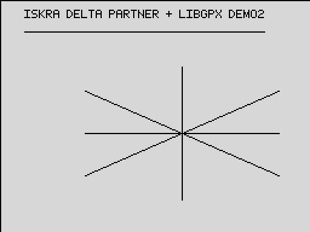
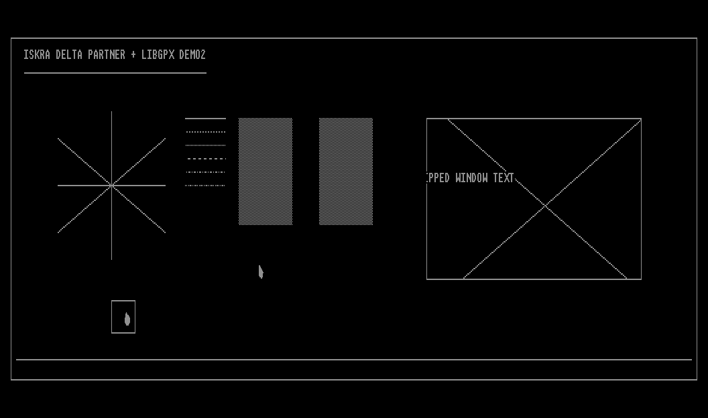
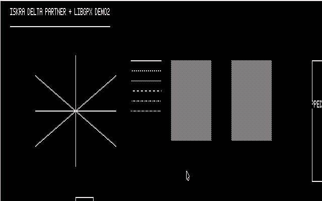
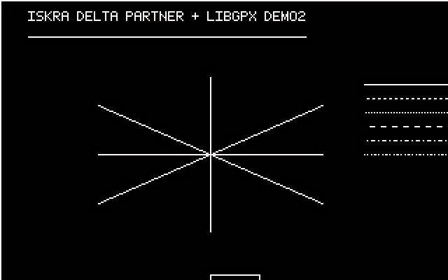

# Demo 2 — full-API smoke test

Demo 2 puts most of libgpx's public drawing API into one diagnostic picture.
It was laid out as a 1024x256 Iskra Delta Partner hardware test, but the same C
source now builds and runs on the ZX Spectrum as well. The Spectrum capture is
therefore a useful clipping test: only the part of the Partner-sized scene
inside its 256x192 viewport is visible.

## ZX Spectrum 48K



## Iskra Delta Partner



### Amstrad CPC — 640 x 200



### Amstrad CPC — 320 x 200




## Reading the picture

The complete Partner scene contains:

1. system-font title text with an underline computed by `gpx_measure_text`
2. an eight-octant line star that exercises every vector direction
3. solid, dotted, dashed, dot-dash, and arbitrary `0xA5` line patterns
4. a near-full-width line that forces the Partner backend to chain vectors
5. a clipped window containing two diagonals and clipped text
6. two checker squares; the right one has survived a sprite show/hide cycle
7. one visible cursor and one cursor clipped to a small window
8. a full-screen border

On the Spectrum, the title, its underline, and the octant star fit inside the
physical display. The remaining Partner-coordinate artwork is rejected by
screen clipping. This difference is intentional and demonstrates that signed,
out-of-range coordinates do not corrupt the Spectrum framebuffer.

## Built-in checks

The checker squares should be pixel-for-pixel identical. A cursor was shown and
hidden over the right square, so any damage there would expose a broken sprite
restore path. The small box near the lower-left of the Partner scene should
contain only the portion of the hand cursor that intersects its clip rectangle.

## Main program

```c
#include "libgpx.h"

/*
 * demo2 -- fixed-size hardware smoke test for libgpx.
 *
 * Exercises the whole public API in one 1024x256 picture, laid out so the
 * Partner screen can be verified against this checklist on real hardware.
 * The same source also runs on the 256x192 ZX Spectrum, where physical-screen
 * clipping leaves only the top-left of the picture visible. The two pattern
 * squares double as a built-in self-check: a cursor sprite was shown AND
 * hidden over the RIGHT one, so both squares must look pixel-for-pixel
 * identical on the Partner.
 *
 *   1. title text with an underline of the measured text width
 *   2. eight-way octant star (hardware vector generator, every quadrant)
 *   3. line style column: solid / dotted / dashed / dot-dash hardware
 *      styles plus an arbitrary 0xA5 pattern (software fallback)
 *   4. near-full-width solid line (vectors past 255 px must chain)
 *   5. a "window": outlined rect, two diagonals and a text string all
 *      clipped to it (exact Cohen-Sutherland + per-bitmap box pre-clip)
 *   6. two identical checker squares; sprite shown+hidden on the right
 *   7. a visible cursor sprite, plus a window-clipped sprite of which
 *      only the part inside its small outlined window may appear
 *   8. full-screen border
 *
 * Build:  make -C samples/demo2 build -> bin/demo2/demo2.tap and demo2.com
 * Exit:   the demo parks in an endless loop; reset the machine.
 */

static uint8_t bg_shown[GPX_SPRITE_BG_SIZE];
static uint8_t bg_round[GPX_SPRITE_BG_SIZE];
static uint8_t bg_clip[GPX_SPRITE_BG_SIZE];

void main(void)
{
    gpx_t *gpx = gpx_create(GPXM_DEFAULT);
    const font_t *font = gpx_get_system_font();
    rect_t win = {620, 60, 940, 180};
    rect_t spr_win = {150, 196, 185, 220};
    rect_t border = {0, 0, 1023, 255};
    rect_t sq_l = {340, 60, 419, 139};
    rect_t sq_r = {460, 60, 539, 139};
    uint8_t checker[2];
    sprite_t shown;
    sprite_t round;
    sprite_t clipped;
    coord w;

    checker[0] = 0xAA;
    checker[1] = 0x55;

    /* 1: title + measured underline */
    gpx_draw_text(gpx, 20, 8, "ISKRA DELTA PARTNER + LIBGPX DEMO2", font,
                  CO_FORE, BM_CPY, (const rect_t *)0);
    w = gpx_measure_text("ISKRA DELTA PARTNER + LIBGPX DEMO2", font);
    gpx_draw_line(gpx, 20, 26, (coord)(20 + w - 1), 26, CO_FORE, BM_CPY,
                  0xFF, (const rect_t *)0);

    /* 2: octant star around (150, 110) */
    gpx_draw_line(gpx, 150, 110, 230, 110, CO_FORE, BM_CPY, 0xFF, (const rect_t *)0);
    gpx_draw_line(gpx, 150, 110, 230, 145, CO_FORE, BM_CPY, 0xFF, (const rect_t *)0);
    gpx_draw_line(gpx, 150, 110, 150, 165, CO_FORE, BM_CPY, 0xFF, (const rect_t *)0);
    gpx_draw_line(gpx, 150, 110, 70, 145, CO_FORE, BM_CPY, 0xFF, (const rect_t *)0);
    gpx_draw_line(gpx, 150, 110, 70, 110, CO_FORE, BM_CPY, 0xFF, (const rect_t *)0);
    gpx_draw_line(gpx, 150, 110, 70, 75, CO_FORE, BM_CPY, 0xFF, (const rect_t *)0);
    gpx_draw_line(gpx, 150, 110, 150, 55, CO_FORE, BM_CPY, 0xFF, (const rect_t *)0);
    gpx_draw_line(gpx, 150, 110, 230, 75, CO_FORE, BM_CPY, 0xFF, (const rect_t *)0);

    /* 3: style column (hardware styles, then software 0xA5 fallback) */
    gpx_draw_line(gpx, 260, 60, 320, 60, CO_FORE, BM_CPY, 0xFF, (const rect_t *)0);
    gpx_draw_line(gpx, 260, 70, 320, 70, CO_FORE, BM_CPY, 0xCC, (const rect_t *)0);
    gpx_draw_line(gpx, 260, 80, 320, 80, CO_FORE, BM_CPY, 0xAA, (const rect_t *)0);
    gpx_draw_line(gpx, 260, 90, 320, 90, CO_FORE, BM_CPY, 0xF0, (const rect_t *)0);
    gpx_draw_line(gpx, 260, 100, 320, 100, CO_FORE, BM_CPY, 0xE4, (const rect_t *)0);
    gpx_draw_line(gpx, 260, 110, 320, 110, CO_FORE, BM_CPY, 0xA5, (const rect_t *)0);

    /* 4: near-full-width line (chained vectors) */
    gpx_draw_line(gpx, 8, 240, 1015, 240, CO_FORE, BM_CPY, 0xFF, (const rect_t *)0);

    /* 5: the window -- everything inside is clipped to it */
    gpx_draw_rectangle(gpx, &win, CO_FORE, BM_CPY, 0xFF, (const rect_t *)0);
    gpx_draw_line(gpx, 560, 20, 1010, 220, CO_FORE, BM_CPY, 0xFF, &win);
    gpx_draw_line(gpx, 1010, 30, 560, 230, CO_FORE, BM_CPY, 0xFF, &win);
    gpx_draw_text(gpx, 600, 100, "CLIPPED WINDOW TEXT", font,
                  CO_FORE, BM_CPY, &win);

    /* 6: identical checker squares; right one gets a sprite round-trip */
    gpx_fill_rectangle(gpx, &sq_l, CO_FORE, BM_CPY, checker, 2, (const rect_t *)0);
    gpx_fill_rectangle(gpx, &sq_r, CO_FORE, BM_CPY, checker, 2, (const rect_t *)0);
    round.x = 490;
    round.y = 90;
    round.bitmap = gpx_get_stock_bmp(GPXSB_CURSOR_STD);
    round.background = (bmp_t *)bg_round;
    round.clip = (const rect_t *)0;
    gpx_show_sprite(gpx, &round);
    gpx_hide_sprite(gpx, &round);      /* squares must now match exactly */

    /* 7: a sprite left visible, and a window-clipped sprite */
    shown.x = 370;
    shown.y = 170;
    shown.bitmap = gpx_get_stock_bmp(GPXSB_CURSOR_STD);
    shown.background = (bmp_t *)bg_shown;
    shown.clip = (const rect_t *)0;
    gpx_show_sprite(gpx, &shown);

    gpx_draw_rectangle(gpx, &spr_win, CO_FORE, BM_CPY, 0xFF, (const rect_t *)0);
    clipped.x = 170;
    clipped.y = 205;
    clipped.bitmap = gpx_get_stock_bmp(GPXSB_CURSOR_HAND);
    clipped.background = (bmp_t *)bg_clip;
    clipped.clip = &spr_win;
    gpx_show_sprite(gpx, &clipped);    /* only ink inside the small box */

    /* 8: full-screen border */
    gpx_draw_rectangle(gpx, &border, CO_FORE, BM_CPY, 0xFF, (const rect_t *)0);

    for (;;) {
    }
}
```

The rectangles at the top of `main` define the diagnostic regions in Partner
coordinates. The title is underlined using its measured pixel width rather
than a guessed constant. Eight lines radiating from one point cover every
octant, while the six short horizontal lines exercise common and arbitrary
line patterns. Passing `win` to the two diagonals and the text call makes the
large box a clipping test.

The two checker squares test sprite restoration: the program draws and removes
a cursor over the right square, which must then match the untouched left one.
It separately leaves one cursor visible and clips a hand cursor to `spr_win`.
The final border checks inclusive rectangle endpoints. Because all coordinates
describe a 1024x256 canvas, the Spectrum naturally shows only operations that
intersect its smaller physical screen. The endless loop preserves the result.

## Build

From the repository root:

```bash
make -C samples/demo2 build       # both targets
make -C samples/demo2 zx          # bin/demo2/demo2.tap
make -C samples/demo2 partner     # bin/demo2/demo2.com
```

All compilation happens in the pinned Docker toolchain images. The Spectrum
program loads at `0x8000`; the Partner program is a CP/M transient program at
`0x0100`.

## Run

Load `bin/demo2/demo2.tap` in a 48K Spectrum emulator, or run
`bin/demo2/demo2.com` from CP/M on the Partner. The demo parks in an endless
loop after drawing, so reset the emulated machine to exit.

The Spectrum tape can also be launched with:

```bash
scripts/run/run-fuse-demo1.sh bin/demo2/demo2.tap
```

To reproduce both screenshots through the headless MCP emulators:

```bash
python3 scripts/docs/capture-manual-shots.py
```
