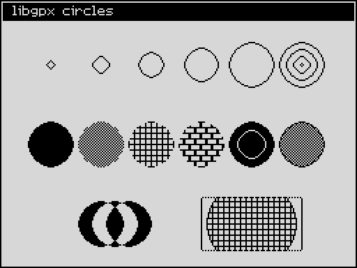
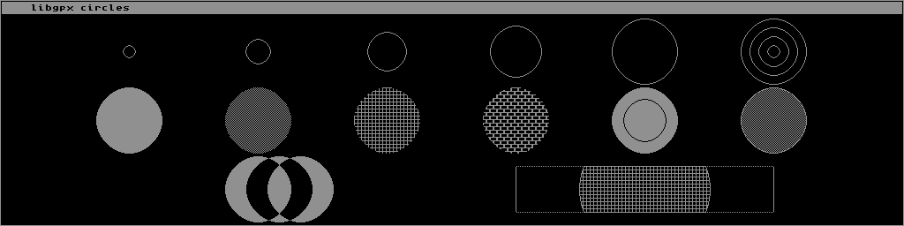
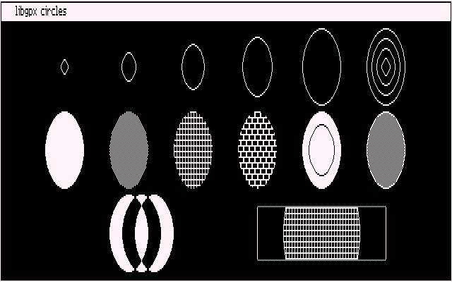
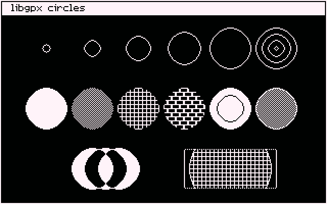

# Demo 4 — circles and filled circles

Demo 4 is a single program, `circles.c`, that exercises the two **advanced**
primitives: `gpx_draw_circle` and `gpx_fill_circle`. Like Demo 3 it derives
every coordinate from `gpx_width()` and `gpx_height()`, so the same source
fills a 256x192 ZX Spectrum display, a 1024x256 Iskra Delta Partner display,
and either of the Amstrad CPC's two modes.

It needs a library built with `ADVANCED` enabled, which is the default. Built
against an `ADVANCED=0` library the link fails with an unresolved
`_gpx_draw_circle`.

## Circles

The screen is three rows:

1. **Outlines** at growing radii, ending in a bullseye — the same call at
   four radii.
2. **Fills**: solid, and three patterns of different lengths; then a solid
   disc with a ring knocked out of it in `CO_BACK`; then a dithered disc
   closed with a solid rim.
3. **XOR and clipping**: three discs XOR'd over each other, and a circle far
   too big for the window it is clipped to.

### ZX Spectrum 48K



### Iskra Delta Partner



### Amstrad CPC — 640 x 200



### Amstrad CPC — 320 x 200



On the CPC the circles come out as ellipses, and that is the display, not
the library. `gpx_draw_circle` works in pixels, and a CPC pixel is not
square: mode 2 fits 640 of them across the same width mode 1 fits 320 into,
so a circle of *r* pixels stands about two and a half times taller than it is
wide on a 4:3 monitor. The captures are doubled vertically, the conventional
way to present CPC screenshots, which is why mode 1 looks nearly round and
mode 2 does not. A program that wants a visually round circle on the CPC has
to scale its radius to the mode itself.

The four pictures are the same drawing at four geometries. Unlike the fonts
and stock cursors in Demo 3, nothing here is per machine: both circle
primitives are one portable module in `src/common` written against
`gpx_draw_pixel` and `gpx_draw_line`, so the backends cannot disagree about a
circle. `tests/conformance` checks exactly that, phase by phase.

### What the rows show

**Row 2, the fifth disc.** The knocked-out ring is `gpx_draw_circle` in
`CO_BACK` at two thirds of the radius. Nothing special is needed to erase
into a fill: the outline is just pixels in the background colour.

**Row 2, the sixth disc.** A `0xAA, 0x55` dither leaves the disc's edge
ragged, because a pattern bit that is 0 is skipped rather than drawn. Drawing
the outline of the *same* radius over it closes the edge exactly — the fill
and the outline walk the same stepper, so the rim lands on the disc's own
boundary rather than inside or outside it.

**Row 3, the XOR discs.** Three overlapping discs in `BM_XOR`, so each
overlap cancels back out. This only works because every row of a fill is
painted exactly once; a fill that touched a row twice would leave the
overlaps solid.

**Row 3, the clipped circle.** The window is drawn dotted, and both the fill
and the outline are clipped to it. The pattern keeps the phase it would have
had unclipped, which is why the mesh lines up with the window edge rather
than restarting at it.

### Main program

```c
/*
 * circles.c
 *
 * libgpx demo 4: the ADVANCED circle primitives -- outlines at growing
 * radii, pattern fills, a disc with a contrasting rim, XOR overlap and
 * a clipped circle.
 *
 * The same source builds for the ZX Spectrum (256x192), the Iskra Delta
 * Partner (1024x256) and the Amstrad CPC (640x200 or 320x200), so every
 * coordinate is derived from gpx_width() and gpx_height() rather than
 * hard-coded.
 *
 * Needs a library built with ADVANCED enabled, which is the default.
 *
 * GPL2 License (see: LICENSE)
 * Copyright (C) 2026 Tomaz Stih
 */
#include "libgpx.h"

/* The Amstrad CPC has two display modes and one library, so the demo's
 * screenshots are taken twice from this one source. Everything below is
 * derived from gpx_width()/gpx_height(), so only this line changes. */
#ifndef DEMO_MODE
#define DEMO_MODE GPXM_DEFAULT
#endif

static uint8_t patt_solid[1] = {0xFF};
static uint8_t patt_half[2]  = {0xAA, 0x55};
static uint8_t patt_brick[4] = {0xFF, 0x88, 0x88, 0x88};
static uint8_t patt_mesh[8]  = {0xFF, 0x81, 0x81, 0x81,
                                0xFF, 0x18, 0x18, 0x18};

/* Ring of concentric outlines, drawn from the outside in. */
static void bullseye(gpx_t *gpx, coord x, coord y, coord r, coord step)
{
    while (r > 0) {
        gpx_draw_circle(gpx, x, y, r, CO_FORE, BM_CPY, 0);
        r = (coord)(r - step);
    }
}

void main(void)
{
    gpx_t *gpx = gpx_create(DEMO_MODE);
    const font_t *font = gpx_get_system_font();
    dim w = gpx_width();
    dim h = gpx_height();
    coord bar = (coord)(font->glyph_height + 4);
    coord top = (coord)(bar + 6);
    coord band = (coord)((h - top - 3) / 3);   /* three rows of circles */
    coord step = (coord)(w / 7);               /* six across a row */
    coord rmax;
    rect_t r;
    coord i;

    /* The biggest circle that fits a cell, whichever way the display is
     * shaped: wide and short on the Partner, nearly square on the ZX. */
    rmax = (coord)(band / 2 - 2);
    if (rmax > (coord)(step / 2 - 2))
        rmax = (coord)(step / 2 - 2);

    gpx_clrscr();

    /* Outer frame and a reverse-video title bar. */
    r.x0 = 0; r.y0 = 0; r.x1 = (coord)(w - 1); r.y1 = (coord)(h - 1);
    gpx_draw_rectangle(gpx, &r, CO_FORE, BM_CPY, 0xFF, 0);
    r.x0 = 2; r.y0 = 2; r.x1 = (coord)(w - 3); r.y1 = (coord)(bar + 2);
    gpx_fill_rectangle(gpx, &r, CO_FORE, BM_CPY, patt_solid, 1, 0);
    gpx_draw_text(gpx, (coord)(step / 4), 4, "libgpx circles", font,
                  CO_BACK, BM_CPY, 0);

    /* Row 1: outlines, growing. The last cell holds a bullseye instead,
     * which is the same primitive called at four radii. */
    {
        coord cy = (coord)(top + band / 2);

        for (i = 0; i < 5; i++)
            gpx_draw_circle(gpx, (coord)(step * (i + 1)), cy,
                            (coord)(rmax * (i + 1) / 5),
                            CO_FORE, BM_CPY, 0);
        bullseye(gpx, (coord)(step * 6), cy, rmax, (coord)(rmax / 4 + 1));
    }

    /* Row 2: the same disc filled four ways, then one with a ring
     * knocked out of it in CO_BACK, then a patterned one closed with a
     * solid rim. The rim lands exactly on the disc's own edge -- the fill
     * and the outline walk the same stepper -- so a dithered disc can be
     * given a clean edge by drawing the outline over it. */
    {
        coord cy = (coord)(top + band + band / 2);

        gpx_fill_circle(gpx, (coord)(step * 1), cy, rmax,
                        CO_FORE, BM_CPY, patt_solid, 1, 0);
        gpx_fill_circle(gpx, (coord)(step * 2), cy, rmax,
                        CO_FORE, BM_CPY, patt_half, 2, 0);
        gpx_fill_circle(gpx, (coord)(step * 3), cy, rmax,
                        CO_FORE, BM_CPY, patt_brick, 4, 0);
        gpx_fill_circle(gpx, (coord)(step * 4), cy, rmax,
                        CO_FORE, BM_CPY, patt_mesh, 8, 0);

        gpx_fill_circle(gpx, (coord)(step * 5), cy, rmax,
                        CO_FORE, BM_CPY, patt_solid, 1, 0);
        gpx_draw_circle(gpx, (coord)(step * 5), cy, (coord)(rmax * 2 / 3),
                        CO_BACK, BM_CPY, 0);

        /* An outline over a patterned fill: the rim is the disc's edge. */
        gpx_fill_circle(gpx, (coord)(step * 6), cy, rmax,
                        CO_FORE, BM_CPY, patt_half, 2, 0);
        gpx_draw_circle(gpx, (coord)(step * 6), cy, rmax,
                        CO_FORE, BM_CPY, 0);
    }

    /* Row 3: three discs XOR'd over each other, so every overlap comes
     * back out again -- each row of a fill is painted exactly once, which
     * is what makes that work -- and a circle far too big for the window
     * it is clipped to. */
    {
        coord cy = (coord)(top + 2 * band + band / 2);
        coord ox = (coord)(rmax * 2 / 3);

        for (i = 0; i < 3; i++)
            gpx_fill_circle(gpx, (coord)(step * 2 + i * ox), cy, rmax,
                            CO_FORE, BM_XOR, patt_solid, 1, 0);

        {
            static rect_t win;

            win.x0 = (coord)(step * 4);
            win.y0 = (coord)(cy - band / 3);
            win.x1 = (coord)(step * 6);
            win.y1 = (coord)(cy + band / 3);
            gpx_draw_rectangle(gpx, &win, CO_FORE, BM_CPY, 0xAA, 0);
            gpx_fill_circle(gpx, (coord)(step * 5), cy, (coord)(rmax * 2),
                            CO_FORE, BM_CPY, patt_brick, 4, &win);
            gpx_draw_circle(gpx, (coord)(step * 5), cy, (coord)(rmax * 2),
                            CO_FORE, BM_CPY, &win);
        }
    }

    gpx_destroy(gpx);
}
```

## Build

From the repository root:

```bash
make -C samples/demo4 build       # both targets
make -C samples/demo4 zx          # bin/demo4/circles.tap
make -C samples/demo4 partner     # bin/demo4/circles.com
```

All compilation happens in the pinned Docker toolchain images. Spectrum tapes
load at `0x8000`; Partner programs are CP/M transient programs at `0x0100`.

## Run

Load the `.tap` in a 48K Spectrum emulator, or run the `.com` from CP/M on the
Partner:

```bash
scripts/run/run-fuse-demo1.sh bin/demo4/circles.tap
```

To rebuild every sample screenshot, this one included, and run them through
all three headless MCP emulators:

```bash
python3 scripts/docs/capture-manual-shots.py
```
